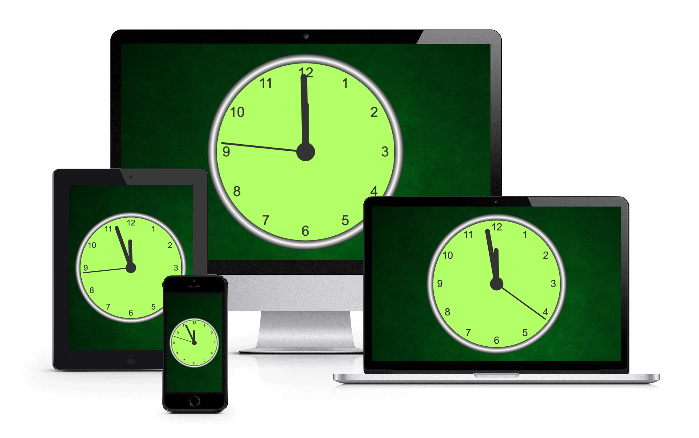

# ClockJS
Goal this application is shown classical hands a clock. Clock is diplay onto html component canvas and every second is update all
canvas area. You can show clock on different devices from personal computer to smartphones with access on the internet. Diversity support responsive design used in application, it capable adapt on any screen size. I developed the application for study purpose when I learned Javascript language. 

## Technologies
* HTML
* CSS
* Javascript

## Access
If you can show the actual time, click on this [link](http://www.jiricaga.cz/clock/).
